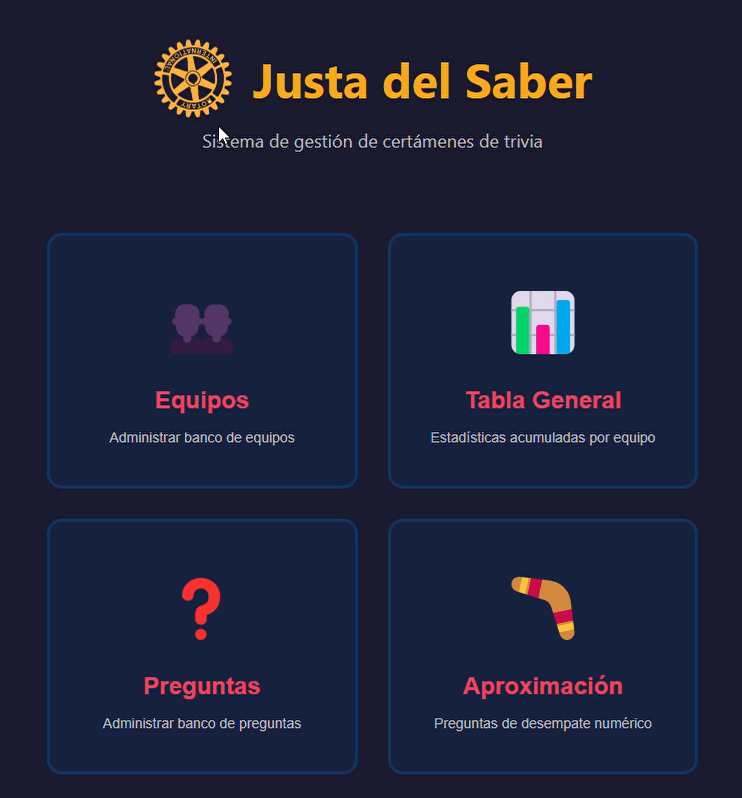
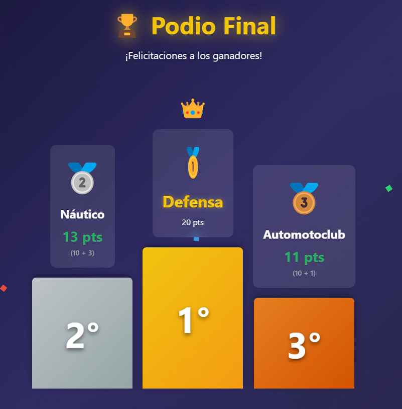
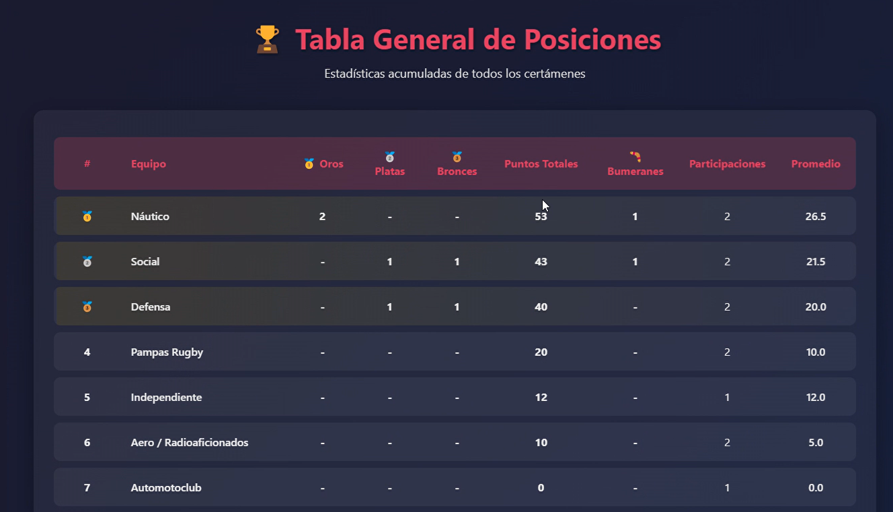

# 🎯 Trivia App – Gestión de certámenes en tiempo real

Aplicación de escritorio desarrollada con Electron, React y TypeScript para gestionar competencias de trivia de forma integral.

## 🖼️ Vista general

### 📷 Capturas

## 🎯 Contexto

Este proyecto surge tras participar en una trivia organizada por el Rotary Club, donde detecté problemas en la dinámica del evento:

- dificultad para seguir puntajes
- confusión en desempates
- experiencia poco clara para el público

Decidí desarrollar una solución que mejore tanto la operación como la experiencia del juego.

---

## 💡 Problema

Los certámenes se gestionaban de forma manual, lo que generaba:

- Dificultad para seguir el puntaje en tiempo real  
- Experiencia confusa para el público  
- Alto margen de error en desempates  
- Flujo de juego poco dinámico  

---

## 🚀 Solución

Desarrollé una aplicación que centraliza toda la lógica del certamen y mejora la experiencia general:

- Gestión completa del juego desde una única interfaz  
- Puntaje automático y ranking en tiempo real  
- Sistema estructurado de desempates  
- Flujo de juego claro, ágil y replicable  

---

## 🧠 Decisiones de producto

Algunas decisiones clave durante el desarrollo:

- **Desempates simultáneos:** todos los empates se resuelven con la misma pregunta para mantener ritmo y claridad  
- **Timer con alerta sonora:** genera tensión y mejora la dinámica del juego  
- **Persistencia local:** evita depender de conectividad durante el evento  
- **Bancos reutilizables:** separación de equipos y preguntas para facilitar reutilización  
- **Visualización en tiempo real:** foco en que tanto participantes como público puedan seguir el estado del juego
- **Persistencia Histórica:** ahora existe una tabla histórica que permite persistir el rendimiento de los equipos entre distintas ediciones
- **Puntaje adicional por desempates:** mantiene inalterada la resolución y agrega valor a la tabla general histórica del equipo
- **Premio Boomerang:** agrega valor a la tabla histórica del equipo al premiar el "arrojo" cuando un equipo gana la última instancia de desempate

---

## 🖥️ Features principales

### Gestión de bancos

- Banco de equipos con persistencia local  
- Banco de preguntas (opción múltiple)  
- Banco de preguntas de aproximación (numéricas)

### Certámenes

- Asistente paso a paso para configuración  
- Persistencia automática  
- Timer configurable (30s default, alerta a los 10s)  
- Marcador en tiempo real ordenado por ranking  
- Navegación de preguntas  

### Modo de Prueba

- El timer se ajusta a 0s para poder probar el flujo sin esperar
- Los resultados en este modo no persisten en la tabla general

### Sistema de puntuación

- +10 puntos por respuesta correcta (configurable)  

### Sistema de desempates

- Desempate regular con preguntas específicas  
- Desempate por aproximación para casos persistentes  
- Resolución simultánea de empates  
- Cómputo independiente por posición  

### Estadísticas

- Tabla histórica de certámenes  
- Medallero (oro, plata, bronce)  
- Métricas por equipo (puntos, participaciones, promedios)  

### Persistencia

- Memoria Local
- Exportar e Importar Datos

---

## 🧩 Arquitectura
trivia-app/
- ├── src/
- │ ├── main/ # Proceso principal de Electron
- │ └── renderer/ # Frontend (React)
- │ ├── components/
- │ ├── utils/
- │ └── App.tsx
- **Electron**: contenedor de aplicación desktop  
- **React**: UI y manejo de estado  
- **TypeScript**: tipado estático  
- **Vite**: build tool  

---

## ⚙️ Instalación y uso

### Requisitos

- Node.js 18+
- npm 9+

### Desarrollo

npm install
npm run dev

### Producción

npm run build
npm start

### Empaquetado

npm run package

---

## 🕹️ Flujo de uso
Crear bancos de equipos y preguntas
Configurar un certamen con el asistente
Ejecutar el juego con timer y scoring en tiempo real
Resolver empates automáticamente
Visualizar resultados y estadísticas

## 💾 Persistencia

La aplicación utiliza localStorage para almacenar:

Equipos
Preguntas
Certámenes
Estadísticas

Esto permite funcionamiento offline sin necesidad de backend.

## 🎨 Personalización
Timer configurable desde código
Puntaje modificable
Tema visual editable vía CSS variables

## ⚠️ Problemas conocidos

En algunos entornos, Electron puede presentar problemas de renderizado en inputs tras eliminar todos los certámenes.

Solución temporal: minimizar y restaurar la ventana.

## 🔍 Aprendizajes

Este proyecto fue una oportunidad para:

Construir un producto completo end-to-end
Traducir una necesidad real en una solución concreta
Profundizar en decisiones de UX en contextos en vivo
Pasar de un enfoque más exploratorio a uno más estructurado (SDD)

## 📄 Licencia

Este proyecto está bajo licencia MIT.  
Podés usarlo libremente respetando los términos de la licencia.

## 👤 Autor

germen

## 🎥 Demo completa

